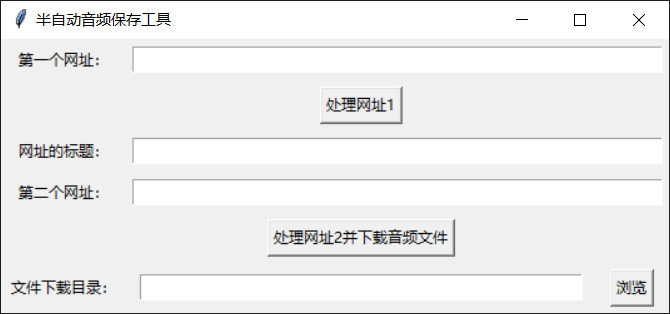

## **基于tkinter的简易界面的下载歌曲程序**

以网站`https://www.kumeiwp.com/`的html结构完成的自动提取歌曲标题和下载歌曲。

支持：

- 输入第一个网址得到歌曲的标题和该歌曲的下载网址，并将内容展示到页面上的文本框内

- 在第一个文本框内输入第一个网址得到歌曲的标题，并展示到界面上的第二个文本框内；在第三个文本框内输入第二个网址
- 选择下载目录
- 将歌曲以歌曲标题为名保存到所选目录下

**该应用程序在处理多个歌曲的下载时会节约大量时间。**




## 使用（新）

可以用python脚本，也可以在dist目录下用可执行文件（`semi-automatic_audio_saving _tool.exe`）运行。

以[理查德克莱德曼 - 天空之城钢琴曲.mp3 免费下载 酷美网盘 支持外链 (kumeiwp.com)](https://www.kumeiwp.com/file/160494.html)下载该歌曲作为一个例子。

- 将歌曲网址复制到`文本框：第一个网址`内。


- 点击`按钮：处理网址1`。将根据网站信息自动产生`文本框：网址的标题`和`文本框：第二个网址`。


- 修改`文本框：网址的标题`，点击`浏览`选择下载目录。**（标题无需再tian'jia`.mp3`后缀）


- 点击`按钮：处理网址2并下载音频文件`


完成下载


如果成功下载，则会将文本框内容清空，进行下一个歌曲下载。


失败会有提示信息。


## 使用（旧）

可以用python脚本，也可以在dist目录下用可执行文件（`semi-automatic_audio_saving _tool.exe`）运行。

以[理查德克莱德曼 - 天空之城钢琴曲.mp3 免费下载 酷美网盘 支持外链 (kumeiwp.com)](https://www.kumeiwp.com/file/160494.html)下载该歌曲作为一个例子。

- 首先，将歌曲网址复制到`文本框：第一个网址`内。


- 点击`按钮：处理网址1`，得到歌曲标题。


- 修改标题。（**不需要`.mp3`后缀**）


- 将音频网址复制到`文本框：第二个网址`


- 点击`浏览`，选择下载目录


- 点击`按钮：处理网址2并下载音频文件`


无论成功与否，都会返回一个提示框。


如果成功下载，则会将文本框内容清空，进行下一个歌曲下载。


失败会有提示信息。


## 函数

- 得到下载网址

```python
def get_second_link(url):
```

- 得到网页标题

```python
def get_title(url):
```

- 将网址url中的音频保存到save_path文件内

```python
def download_audio(url, save_path):
```

- 处理第一个网址

```python
def process_url1():
```

- 处理第二个网址

```python
def process_url2():
```

- 选择目录

```python
def browse_path():
```


